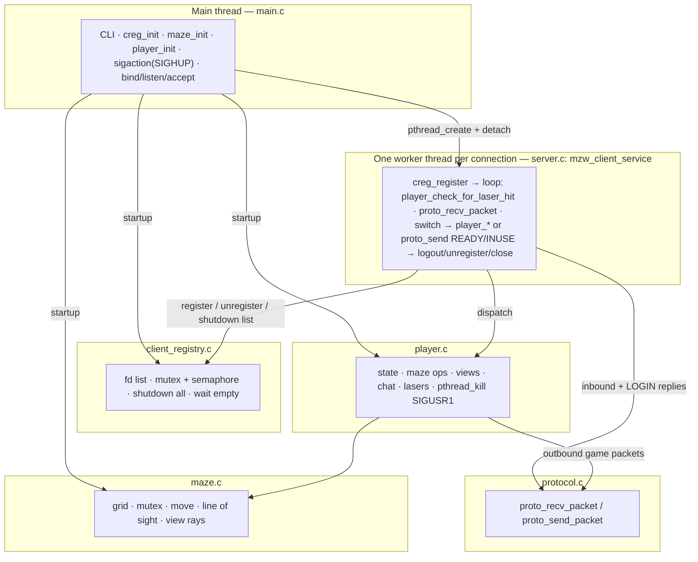

# MazeWar: A Multi-Threaded Network Game Server in C

## Overview

**MazeWar** is a real-time multiplayer network game server built from scratch in C using POSIX sockets and threading. The server supports multiple concurrent players navigating a 2D maze, firing lasers, rotating, moving, and chatting in real time. Each connected client is serviced by its own thread, and the server architecture supports message passing, player coordination, and dynamic view updates.

The project emphasizes low-level network programming, thread-safe shared state management, and concurrent system design. All components—including the networking protocol, client registry, maze logic, and player state—were implemented manually using POSIX-compliant system calls, synchronization primitives, and custom protocol definitions.

---

## Architecture

The server is a **single process**. The **main thread** alone runs **`bind` / `listen` / `accept`**; each accepted TCP connection is handed to a **new detached POSIX thread** that runs `mzw_client_service` in `server.c`.

**What is shared**

- **Game world:** maze grid (`maze.c`) and logical players (`player.c`) live in the process address space. A **mutex** guards the maze; **per-player mutexes** (and a global player map lock) guard player state and sends.
- **Connection lifecycle:** `client_registry.c` holds the set of **active client socket fds** (not maze data). It uses a **mutex** for the fd list and a **semaphore** so `main`, after `shutdown()` on every fd, can **block until the client count reaches zero** and all service threads have unregistered.

**Control flow (matches the code)**

1. **`main` (`main.c`):** Parse `-p` / `-t`, `creg_init()`, `maze_init()`, `player_init()`. **`player_init()`** registers **`SIGUSR1`** (used when another thread signals a laser hit). Then **`sigaction(SIGHUP, …)`** for graceful shutdown. Open the listener and **loop on `accept`**. Each success: **`pthread_create` + `pthread_detach`** into `mzw_client_service` (the worker also calls `pthread_detach`; redundant but harmless).
2. **Worker (`mzw_client_service` in `server.c`):** `creg_register(fd)`. Forever: if logged in, **`player_check_for_laser_hit`** (handles **`SIGUSR1`**-driven hits **before** the next read). Then **`proto_recv_packet`** (`protocol.c`). The **`switch (pkt.type)` in this same function** dispatches to `player_login`, `player_move`, `player_fire_laser`, etc. LOGIN path may **`proto_send_packet`** `READY` / `INUSE` directly here. On disconnect / error: `player_logout` if needed, `creg_unregister`, `close(fd)`.
3. **`player.c`:** Mutates maze through `maze.c`, maintains scores and view caches, **full or diff** `CLEAR`/`SHOW` updates, **broadcasts** chat and scores. Iteration over players uses **snapshot + ref/unref** so broadcasts do not race badly with logout.
4. **Laser hit path:** Shooter’s thread runs `player_fire_laser` → **`pthread_kill(victim_thread, SIGUSR1)`**. Victim’s service loop runs **`player_check_for_laser_hit`** on the next iteration (same thread that owns that connection).
5. **Shutdown path:** **`SIGHUP`** handler **`close`s the listen fd** (accept stops with `EBADF`). **`terminate`** → **`creg_shutdown_all`** → **`shutdown(fd, SHUT_RD)`** on each registered client (blocked **`recv`** / **`read`** returns) → **`creg_wait_for_empty`** → **`creg_fini`**, **`player_fini`**, **`maze_fini`**.

**Packet I/O (directional)**

- **Inbound:** only **`server.c`** calls **`proto_recv_packet`** on the connection fd.
- **Outbound:** **`player.c`** sends game traffic via **`player_send_packet` → `proto_send_packet`**; **`server.c`** sends **`READY` / `INUSE`** on LOGIN without going through `player_send_packet`.

*Diagram notes:* `player_init()` (called from `main`) installs **`SIGUSR1`**. The **`switch`** that maps packet types to `player_*` lives **inside `mzw_client_service`**, not a separate source file.

---

## Features

- 🧠 **Multi-threaded Server Core:** Each client connection spawns a dedicated service thread using POSIX threads.
- 🕹️ **Live Avatar Management:** Players control avatars in a shared 2D maze. Movements and actions are broadcast to all clients.
- 🔫 **Laser Combat Mechanics:** Players can fire lasers in the direction of gaze to eliminate opponents temporarily.
- 🔄 **Real-time View Updates:** Each client receives incremental or full screen refreshes based on their avatar’s state and events.
- 💬 **In-game Chat:** Players can send messages visible to all currently connected users.
- 📶 **Custom Protocol Stack:** All communication follows a self-defined packet-based protocol layered over TCP.
- 🔐 **Thread Safety:** Mutexes and semaphores ensure consistent shared state and clean termination.
- 🚦 **Client Registry:** Tracks active connections, supports graceful shutdown, and ensures cleanup of orphaned threads.
- 💥 **Signal-Driven Interaction:** Signals like `SIGUSR1` and `SIGHUP` trigger in-game actions and server control.

---

## Modules

Source under `hw5/src/`, headers under `hw5/include/`.

- `main.c`: CLI, `creg_init` / `maze_init` / `player_init`, `sigaction(SIGHUP)`, listener, accept loop, and `terminate` (shutdown all clients, wait for registry empty, fini modules).
- `server.c`: Per-connection thread entrypoint: register fd, receive loop with laser-hit check, `switch` dispatch to `player_*`, LOGIN `READY`/`INUSE` replies, unregister on exit.
- `protocol.c`: Framed `proto_recv_packet` / `proto_send_packet` over TCP.
- `client_registry.c`: Mutex-protected fd list, semaphore to wait until no clients, `shutdown(SHUT_RD)` on all fds for coordinated exit.
- `maze.c`: Thread-safe grid, movement, line-of-sight, corridor view sampling.
- `player.c`: Avatars, views (full/diff), chat/score broadcasts, laser hits (`pthread_kill` + `SIGUSR1`), snapshot iteration for sends.

---

## Gameplay Summary

- Players control avatars using arrow keys and the Escape key (fire).
- Movement is restricted by maze walls and other avatars.
- Hitting another player with a laser temporarily removes them from the maze and increments your score.
- Chat messages and scoreboards are updated in real-time.
- When avatars come into view, visual updates are immediately sent to the affected clients.
