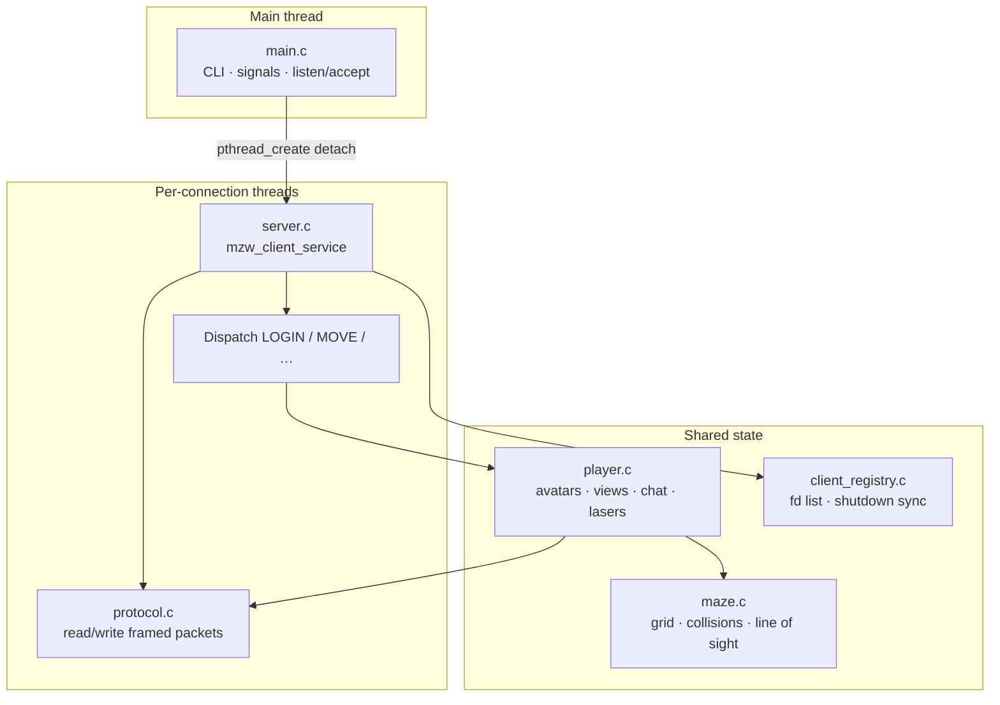

# MazeWar: A Multi-Threaded Network Game Server in C

## Overview

**MazeWar** is a real-time multiplayer network game server built from scratch in C using POSIX sockets and threading. The server supports multiple concurrent players navigating a 2D maze, firing lasers, rotating, moving, and chatting in real time. Each connected client is serviced by its own thread, and the server architecture supports message passing, player coordination, and dynamic view updates.

The project emphasizes low-level network programming, thread-safe shared state management, and concurrent system design. All components—including the networking protocol, client registry, maze logic, and player state—were implemented manually using POSIX-compliant system calls, synchronization primitives, and custom protocol definitions.

---

## Architecture

The server is a **single process** with a **listener thread** and **one POSIX thread per TCP connection**. Shared game state (maze grid, player table) lives in the address space of all threads; **mutexes** protect the maze and per-player data, and the **client registry** uses a **mutex + semaphore** so shutdown can wait until every service thread has exited.

**Control flow**

1. `main` parses arguments, initializes `client_registry`, `maze`, and `player`, installs `SIGHUP` (graceful stop), then `listen` / `accept` in a loop.
2. Each accepted socket is handed to `mzw_client_service` (`server.c`), which registers the fd, reads **framed packets** via `protocol.c`, and dispatches by type (`LOGIN`, `MOVE`, `TURN`, `FIRE`, `REFRESH`, `SEND`, …).
3. `player.c` applies actions against the maze, updates scores, **diffs or full-refreshes** each client’s corridor view, and **broadcasts** chat and score packets to all connected players (using a snapshot of active players to avoid races with logout).
4. Laser hits use **`pthread_kill` + `SIGUSR1`** on the victim’s service thread so hit handling runs in the correct context; server-wide shutdown uses **`SIGHUP`** to close the listener and **`shutdown()`** on registered fds so blocked reads wake up and threads can exit cleanly.

---

## Features

- 🧠 **Multi-threaded Server Core:** Each client connection spawns a dedicated service thread using POSIX threads.
- 🕹️ **Live Avatar Management:** Players control avatars in a shared 2D maze. Movements and actions are broadcast to all clients.
- 🔫 **Laser Combat Mechanics:** Players can fire lasers in the direction of gaze to eliminate opponents temporarily.
- 🔄 **Real-time View Updates:** Each client receives incremental or full screen refreshes based on their avatar’s state and events.
- 💬 **In-game Chat:** Players can send messages visible to all currently connected users.
- 📶 **Custom Protocol Stack:** All communication follows a self-defined packet-based protocol layered over TCP.
- 🔐 **Thread Safety:** Mutexes and semaphores ensure consistent shared state and clean termination.
- 🚦 **Client Registry:** Tracks active connections, supports graceful shutdown, and ensures cleanup of orphaned threads.
- 💥 **Signal-Driven Interaction:** Signals like `SIGUSR1` and `SIGHUP` trigger in-game actions and server control.

---

## Modules

Source under `hw5/src/`, headers under `hw5/include/`.

- `main.c`: Initializes the server, handles command-line options, sets up signals, and starts the accept loop.
- `protocol.c`: Implements sending and receiving of structured packets over sockets.
- `client_registry.c`: Tracks active clients using semaphores and handles cleanup on shutdown.
- `maze.c`: Manages the internal maze layout, avatar positions, and collision logic.
- `player.c`: Manages individual player state, handles view rendering, laser hits, scoring, and synchronization.

---

## Gameplay Summary

- Players control avatars using arrow keys and the Escape key (fire).
- Movement is restricted by maze walls and other avatars.
- Hitting another player with a laser temporarily removes them from the maze and increments your score.
- Chat messages and scoreboards are updated in real-time.
- When avatars come into view, visual updates are immediately sent to the affected clients.
